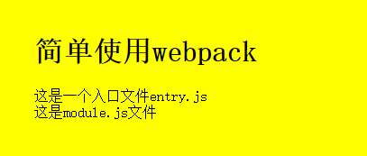

# Webpack 的特点

### 代码拆分

 Webpack有两种组织模块依赖方式：同步和异步；

### Loader

webpack 本身只能处理原生的javascript模块，但是loader转换器可以将各种类型的资源转换成javascript模块。这样任何资源都可以成为webpack可以出来的模块。

### 智能解析

Webpack 有一个智能解析器，几乎可以处理任何第三方库，无论它们的模块形式是 CommonJS、 AMD 还是普通的 JS 文件。甚至在加载依赖的时候，允许使用动态表达式 `require("./templates/" + name + ".jade")`。

### 插件系统

Webpack 还有一个功能丰富的插件系统。大多数内容功能都是基于这个插件系统运行的，还可以开发和使用开源的 Webpack 插件，来满足各式各样的需求。

### 快速运行

Webpack 使用异步 I/O 和多级缓存提高运行效率，这使得 Webpack 能够以令人难以置信的速度快速增量编译。


# 安装

首先需要安装**node.js**，**node.js**自带了软件包管理器**npm**, **webpack**需要node.js v0.6以上支持，建议使用最新版node.js

###### 用npm安装webpack：

```
npm install webpack -g 
```

此方法是将webpack安装到全局环境下。

通常我们会将webpack安装到项目的依赖中，这样就可以使用项目本地版本的webpack

```javascript
mkdir webpack-install
//创建项目
cd webpack-install
// 并进入项目 
npm init 
//如果没有package.json包，就通过此方法创建，一直按回车即可出线以下界面即可

npm install webpack --save-dev 
//安装webpack依赖

$ npm info webpack
//查看 webpack 版本信息

$ npm install webpack@1.12.x --save-dev
// 安装指定版本的 webpack
```

##### npm init 后效果

```
name: (webpack-install) webpack-install
version: (1.0.0)
description:
entry point: (index.js)
test command:
git repository:
keywords:
author:
license: (ISC)
About to write to D:\工作\letv\test\webpack\webpack-book\1-modules\webpack-install\package.json:

{
  "name": "webpack-install",
  "version": "1.0.0",
  "description": "",
  "main": "index.js",
  "scripts": {
    "test": "echo \"Error: no test specified\" && exit 1"
  },
  "author": "",
  "license": "ISC"
}


Is this ok? (yes) 
```

如果需要使用webpack开发工具，要单独安装，如：

```
npm install webpack-dev-server --save-dev
```


# 如何使用webpack

首先创建一个src文件夹，里面有index.html文件和一个js的入口文件entry.js:

```html
<!-- html -->
<html>
<head>
  <meta charset="utf-8">
</head>
<body>
	<h1>简单使用webpack</h1>
  <script src="../dist/bundle.js"></script>
</body>
</html>
```

```javascript
//entry.js
document.write('这是一个入口文件，entry.js');
```

然后编译entry.js并打包到dist文件夹下bundle.js：

```javascript
webpack src/entry.js dist/bundle.js
//dist文件夹无需创建，打包的时候自动生成
```

打包过程会显示日志：

```css
Hash: 84f4e09527e7897af97f
Version: webpack 1.13.2
Time: 62ms
    Asset     Size  Chunks             Chunk Names
bundle.js  1.42 kB       0  [emitted]  main
   [0] ./src/entry.js 35 bytes {0} [built]
```

用浏览器打开index.html即可看到如下内容：

 


接下来我们再添加一个模块module.js，并修改入口entry.js：

```javascript
//module.js
module.exports="这是module.js文件"
```

```
//entry.js
document.write('这是一个入口文件，entry.js');
document.write(require('./module.js'));//添加模块
```

 

```css
Hash: ca6d3307cc247d3a40dc
Version: webpack 1.13.2
Time: 61ms
    Asset     Size  Chunks             Chunk Names
bundle.js  1.58 kB       0  [emitted]  main
   [0] ./src/entry.js 83 bytes {0} [built]
   [1] ./src/module.js 31 bytes {0} [built]

```

**Webpack** 会分析入口文件，解析包含依赖关系的各个文件。这些文件模块都打包到一个bundle.js。

**Webpack** 会给每个模块分配一个唯一的ID 并通过这个id索引和访问模块。在页面启动时，会先执行entry.js 中的代码，其他模块会在执行require的时候执行。


