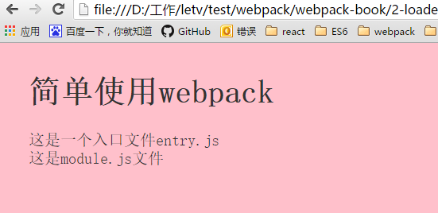

# 配置文件


Webpack 在执行的时候，除了在命令行传入参数，还可以通过指定的配置文件来执行。默认情况下，会搜索当前目录的 `webpack.config.js` 文件，这个文件是一个 node.js 模块，返回一个 json 格式的配置信息对象，或者通过 `--config` 选项来指定配置文件。

依上一节例子，安装`css-loader` `style-loader` ，将其安装到webpack的依赖，package.json包中：

```javascript
npm install css-loader style-loader --save-dev 
```

此时我们可以看到package.json包中的devDependencies多了`css-loader` ` style-loader` 版本号，代表安装依赖成功。

```
{
  "name": "webpack-install",
  "version": "1.0.0",
  "description": "",
  "main": "index.js",
  "scripts": {
    "test": "echo \"Error: no test specified\" && exit 1"
  },
  "author": "",
  "license": "ISC",
  "devDependencies": {
    "css-loader": "^0.25.0",
    "style-loader": "^0.13.1",
    "webpack-dev-server": "^1.15.1"
  }
}
```


接下来我们来创建一个配置文件	`Webpack.config.js`:

```javascript
var webpack = require('webpack');

module.exports={
  //入口
  entry:{
    //key:vaule在出口中，[name]变量就是key
    'index':'./src/entry.js',
  },
  //出口
  output:{
    //文件保存到目标路径下文件夹名称“dist”
    path:'dist',
    //文件保存到目标路径下的文件
    filename:'/[name].b.js'
  },
  module:{
    loaders:[
      //loader转换器，为了便于entry.js文件中直接`./style.css` 的方法引入css路径，而不用复杂的写’!style!css!./style.css'
      {test:/\.css$/,loader:'style!css'}
    ]
  }
}
```

最后不要忘记运行`webpack`

运行中日志：

```CSS
Hash: 2ccc38af96cb9e8e42cd
Version: webpack 1.13.2
Time: 882ms
      Asset     Size  Chunks             Chunk Names
/index.b.js  11.9 kB       0  [emitted]  index
   [0] ./src/entry.js 108 bytes {0} [built]
   [5] ./src/module.js 31 bytes {0} [built]
    + 4 hidden modules

```


可以看到 webpack 通过配置文件执行的结果和上一章节通过命令行 `webpack entry.js bundle.js --module-bind 'css=style!css'` 执行的结果是一样的。


打包编译之后页面刷新结果：




## entry

最初webpack是问了构建SPA (Single Page Application) ,entry是`入口`配置。在entry中的文件才会被编译。


## output

output 控制构建后的文件的存放位置和命名。path定义所有构建后文件的所在目录

